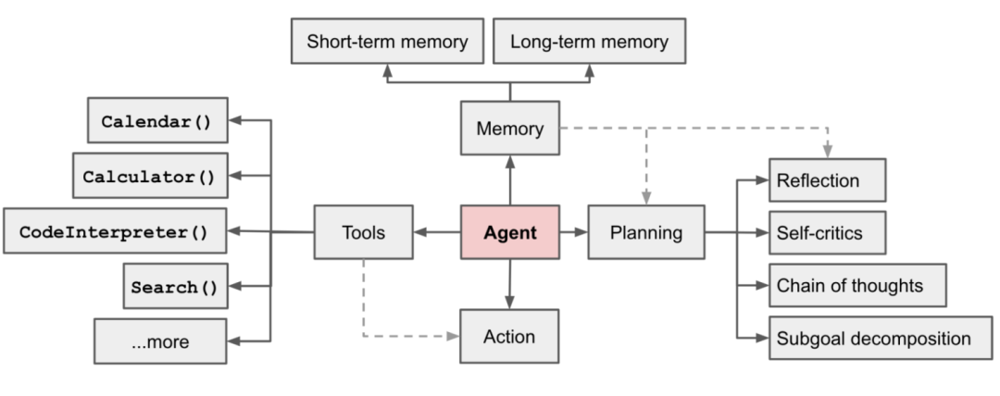

# Agent


从“解释”问题到“解决”问题

大模型只有基本的多轮对话问答能力，没有真正的Step by Step解决问题的能力


## Agent 设计框架

$$
Agent = LLM + 规划 + 记忆 +工具使用
$$

<figure><figcaption>
Composition of the Agent
</figcaption></figure>

* **规划（Planning）：**&#x4E3B;要包括**子目标分解、反思与改进**
* **记忆（Memory）：**&#x5206;为**短期记忆**和**长期记忆**

短期记忆

将所有的上下文学习（比如提示工程Prompt Engineering、情景学习In-Context Learning）都看作模型的短期记忆来学习

长期记忆

利用外部的向量存储和快速检索来存储和召回信息。为Agent提供了长期存储和召回信息的能力

* **工具（Tools）：**&#x8C03;用外部API来获取模型权重（通常在预训练后很难修改）中缺少的额外信息

缺少的额外信息

当前信息，代码执行能力，访问专有信息源等。

* **动作（Action）：**&#x6839;据上述的规划、记忆、工具，大模型才能决策出最终需要执行的动作是什么

