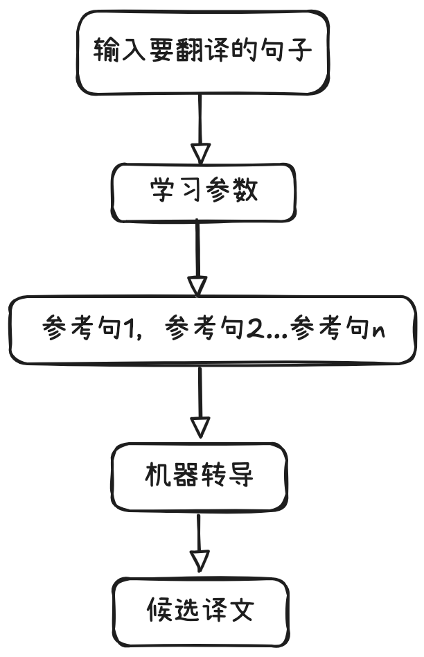

# Browser Use

* **GitHub**: [browser-use/browser-use](https://github.com/browser-use/browser-use)
* **官网**: [browser-use.com](https://browser-use.com/)
* **文档**: [docs.browser-use.com](https://docs.browser-use.com/introduction)


将 Agents 与真实浏览器进行交互，轻松实现浏览器自动化


<figure><figcaption></figcaption></figure>

## Environment

> python ≥ 3.11

```sh
pip install browser-use
```

```
playwright install
```

编辑.env文件

```
OPENAI_API_KEY=...
ANTHROPIC_API_KEY=...
```

## Demo

```python
import os
# Disable telemetry
os.environ["ANONYMIZED_TELEMETRY"] = "false"

import asyncio

from langchain_deepseek import ChatDeepSeek
from browser_use import Agent
from dotenv import load_dotenv
from pydantic import SecretStr

# Disable telemetry before importing browser_use

load_dotenv()

api_key = os.getenv('DEEPSEEK_API_KEY', '')
if not api_key:
    raise ValueError('DEEPSEEK_API_KEY is not set')


async def main():
    agent = Agent(
        task=(
            '1. Go to https://www.google.com '
            "2. Search for 'browser use' in the search bar"
            '3. Click on first result'
            '4. Return the page source'
        ),
        llm=ChatDeepSeek(
            base_url='https://api.deepseek.com/v1',
            model='deepseek-chat',
            api_key=SecretStr(api_key),
        ),
        use_vision=False,
    )

    res = await agent.run()
    print(res)


if __name__ == "__main__":
    asyncio.run(main())

```
