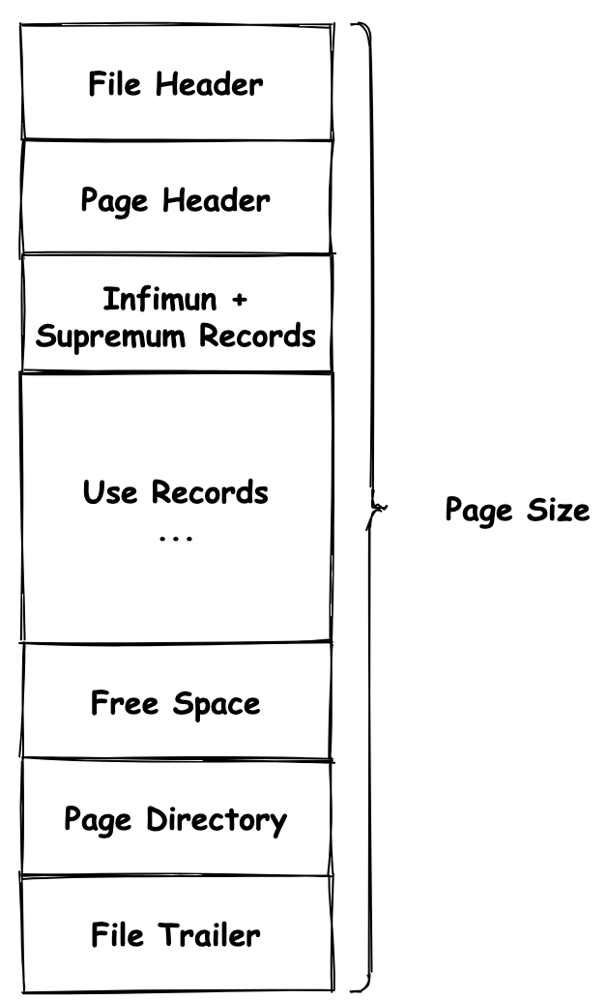

# InnoDB逻辑存储结构

数据页

B+树索引本身并不能找到具体的一条记录，能找到的只是该记录所在的页

把页载入到内存，然后通过 Page Directory 再进行二叉查找

<figure><figcaption>
InnoDB数据页的组成
</figcaption></figure>

***

约束：保证数据的完整性

* Primary Key
* Unique Key
* Foreign Key
  * CASCADE：倾泻，对应的子表数据进行相同操作
  * SET NULL：子表数据更新为NULL值
  * NO ACTION
  * RESTRICT：抛出错误，不允许这类操作发生（默认）
* Default
* NOT NULL

