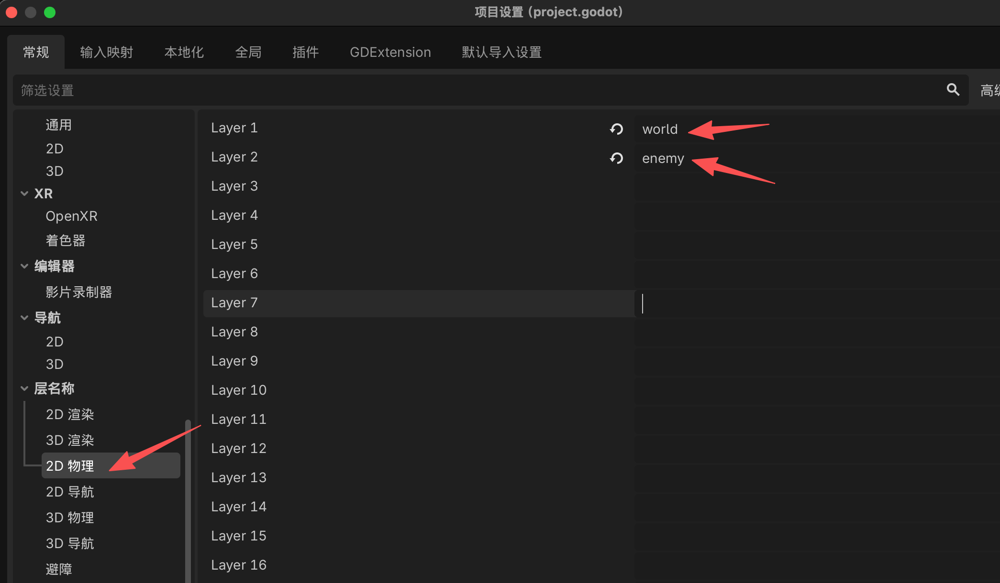

# Godot

## 调整AI Guide

在每一步的开头用简单的代码表示TreeNode目录树以及对应的节点类型


```
Enemy (CharacterBody2D)
├── ColorRect (ColorRect)
└── CollisionShape2D (CollisionShape2D)
```


## 搭建场景

1. 碰撞层：项目 → 项目设置 → General → Layer Names → 2D Physics

<figure><figcaption></figcaption></figure>

2.  怪物：新增场景（理解为元素）CharacterBody2D，双击改名为：Enemy

    <figure><figcaption></figcaption></figure>

添加子节点：占位方块（颜色），ColorRect

<figure><figcaption></figcaption></figure>
