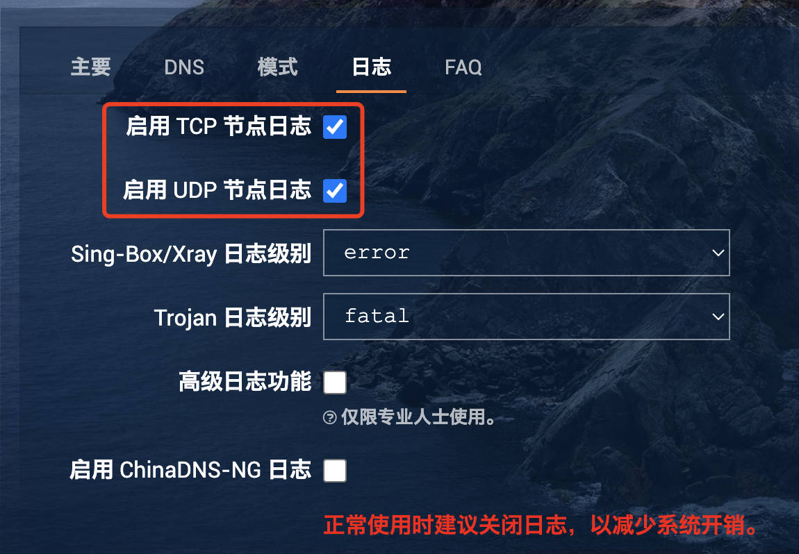

# wifi

## 网段对齐

> 独立局域网解决方案



将网口插入路由器 WAN，或者将猫插入路由器 LAN

进入路由器后台，找到LAN口设置

```
ip: 192.168.100.1
```

设置DHCP 服务器 -> 关闭 -> 保存



**配置 IPv4**

```
ip: 192.168.100.10
子网掩码: 255.255.255.0
dns: 192.168.100.1 (路由器)
```

N1完成处理后可以改回DHCP



将 N1 盒子的网口插入路由器 LAN 口

进入N1后台

网络 -> 接口 -> LAN -> 修改后保存

```
IPv4: 192.168.100.2
IPv4 网关: 192.168.100.1 (路由器)
IPv4 子网掩码: 255.255.255.0
DNS：192.168.100.1
DHCP 设置
* 取消勾选“忽略”
* 强制：勾选
* 增加选项：3,192.168.100.2 (网关是 N1)
* 增加选项：6,192.168.100.2 (DNS 是 N1)
```

passwall 导入订阅

文件上传替代旧版本xray

```
mv /tmp/upload/xray /usr/bin/xray
```

记得对齐系统时间～



## Xray 版本

```shellscript
https://github.com/XTLS/Xray-core/releases/download/v25.12.8/Xray-linux-arm64-v8a.zip
```

## Debug

可以开启日志进行debug

<figure><figcaption></figcaption></figure>

<figure><figcaption></figcaption></figure>
